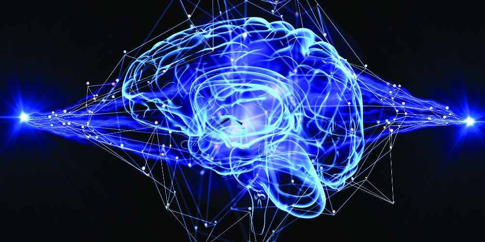
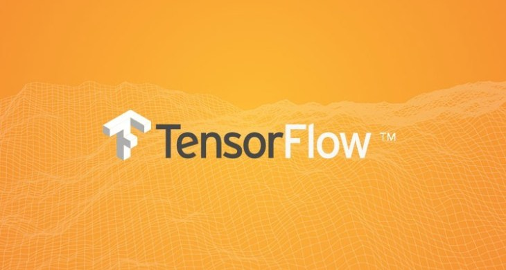

# What is Deep Learning?
Deep Learning is a subfield of machine learning concerned with algorithms inspired by the structure and function of the brain called artificial neural networks.

# What is TensorFlow?
[TensorFlow](https://www.tensorflow.org/) is an open source software library for numerical computation using data-flow graphs. It was originally developed by the Google Brain Team within Google's Machine Intelligence research organization for machine learning and deep neural networks research, but the system is general enough to be applicable in a wide variety of other domains as well.

# Contents

